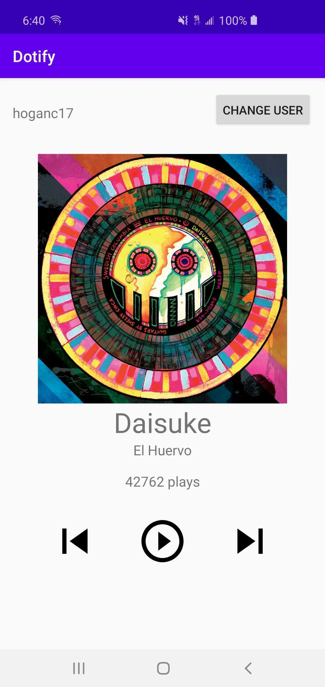

## Homework 1 – Layouts, Widgets, Event Handling: Dotify
## Chris Hogan

Dotify is a prototype app that displays an album art, song title, and artist, as well as a play count for that song. The user can press the play button to increment the play count, "skip" tracks to show a toast, and change their user name.

Attempted Extra Credit: 1, 3, 5

