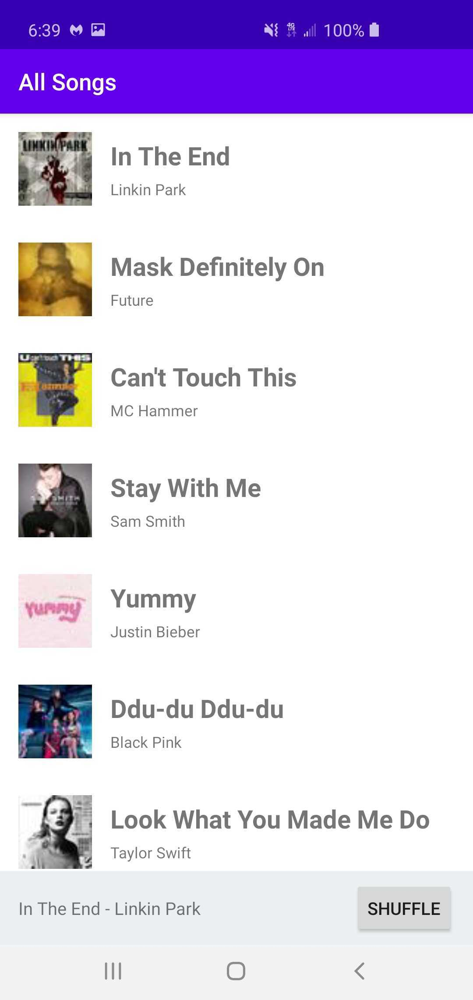
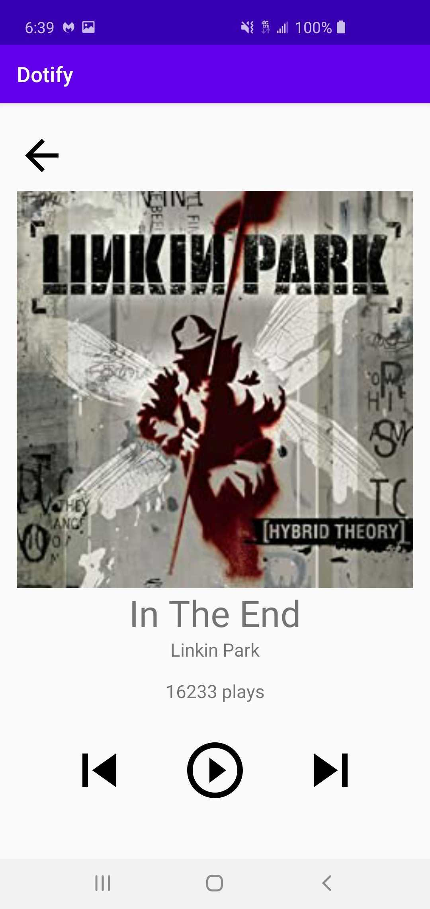
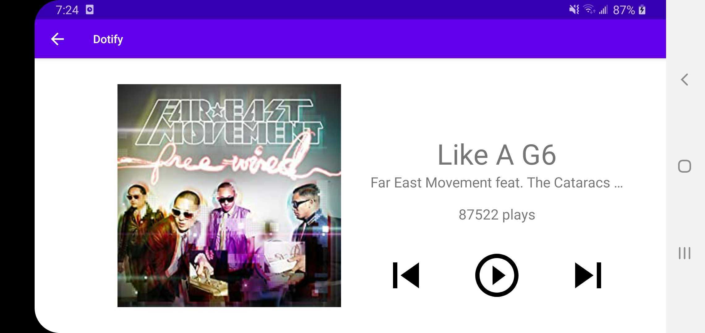

## Homework 3 – Fragments, Activity Lifecycle, and Rotation
## Chris Hogan

Dotify's main screen displays a list of songs that the user  can scroll through and shuffle.
When a user clicks on a song it is displayed on the miniplayer at the bottom.
If they click the miniplayer it opens the full screen player which is a mock song player where the user can press the play button to increase the play count, and left and right arrows to display a "skip track" message.
The orientation of each screen can be changed to landscape, and details such as the current song, order of the list, and play count are preserved.

Behind the scenes, this version of Dotify uses fragments for the song list and song player as opposed to full activities.

