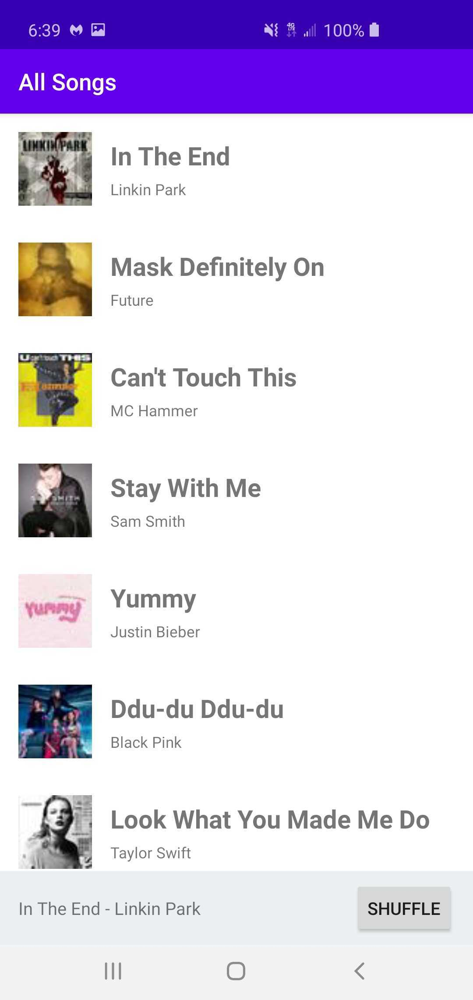
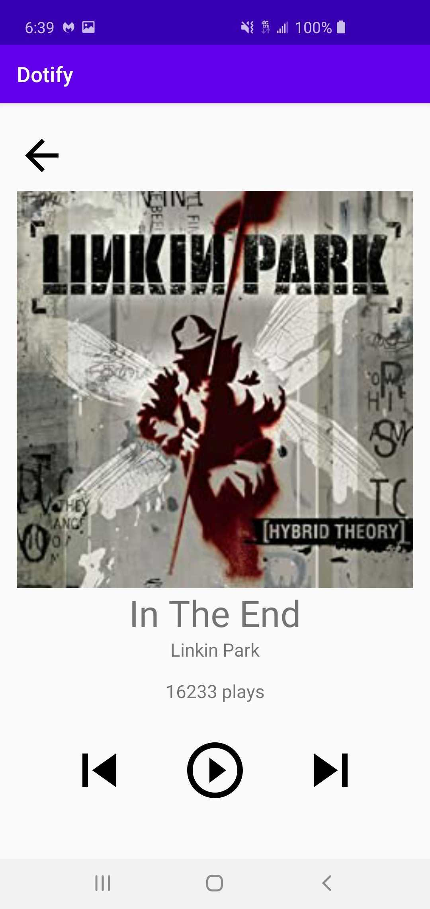

## Homework 2 – Activity & RecyclerView
## Chris Hogan

Dotify's main screen displays a list of songs that the user  can scroll through and shuffle.
When a user clicks on a song it is displayed on the miniplayer at the bottom.
If they click the miniplayer it opens the full screen player which is a mock song player where the user can press the play button to increase the play count, and left and right arrows to display a "skip track" message.

Attempted Extra Credit: 1, 3

